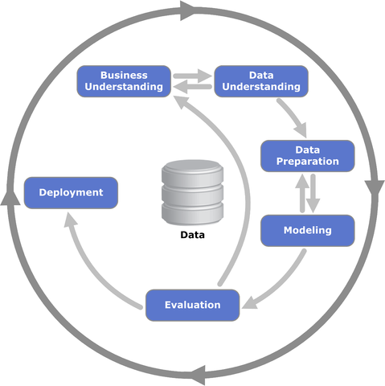

---
output:
  html_document: default
  pdf_document: default
---
Data.Tables
========================================================
author: Mats Hester
date: 27.10.2019
autosize: true
font-import: https://fonts.googleapis.com/css?family=Open+Sans&display=swap
font-family: 'Open Sans', sans-serif;


Data preperation/manipulation
========================================================
incremental: false

Data preparation (transformation / manipulation) is an important step within the data analytics
and in general in the whole data science (crips_dm) process.

- Data scientists spend 80% of their time on colleting, cleaning and organizing data.

- 76% of data scientists view data preparation as the least enjoyable part of their work.

[Source](https://www.forbes.com/sites/gilpress/2016/03/23/data-preparation-most-time-consuming-least-enjoyable-data-science-task-survey-says/#1761fb906f63)

***

  
Cross industry standard process - data mining
Basics
====================================
Data.Tables is a powerful library for data preperation.
The main goal is to make the process overall faster and use the resources more efficiently than similar libraries like dplyr or python.pandas.

## Advantages
- Compact code
- Speed -> Fread, Fwrite, Joins, 
- Memory efficiency -> no duplicates

## Disadvantages
- Unintelligible syntax ->  partly because of the compact code.
- (No duplicates)

***

## Benchmark

[](https://h2oai.github.io/db-benchmark/)
Syntax
=======================================================
## Basic

DT[ i, j, by ] 

- i -> on which rows?
- j -> what to do? 
- by -> grouped by what?

## Chaining

DT[i, j, by][i, j, by]...n+1
***

## Special code
- .sd -> Select the columns for the operation
- .() = c() -> List
- .N -> Number of rows in the group
- .GRP -> Number of the group

[Documentation](https://www.rdocumentation.org/packages/data.table/versions/1.12.2/topics/data.table-package)

Join operation
========================================================
type          | operation
------------- | -------------
right join    | DT[X, on="x"]
left join     | X[DT, on="x"]
inner join    | DT[X, on="x", nomatch=NULL]
not join      | DT[!X, on="x"]
join using column "y" of DT with column "v" of X | DT[X, on=c(y="v")
... |


Data Lichess / 20,058 Games
========================================================
```{r}
library(data.table)
library(dbplyr)
library(magrittr)
library(tidyverse)
dt <- fread('Data/games.csv')
colnames(dt)
head(dt, 2)
```


Code example: Select
========================================================
## data.tables 

```{r}
dt_chess <- dt[,.('playerWhite' = white_id, 'playerBlack' = black_id, winner)]
show(dt_chess)
```
## dplyr

```{r}
library(readr)
df <- read_csv('Data/games.csv')
df %>% select(playerWhite = white_id, playerBlack = black_id, winner, turns)
```


Code example: Where, select, order
========================================================
## data.tables

```{r, echo=FALSE}
dt_chess <- dt[turns <= 70,.(white_id, black_id, winner, turns)][order(-turns)]
show(dt_chess)
```
## dplyr

```{r}
df %>% select(playerWhite = white_id, playerBlack = black_id, winner, turns) %>% filter(turns <= 70) %>% arrange(desc(turns))
```

Code example: Groupby
========================================================
## data.tables

```{r, echo=FALSE}
dt_chess <- dt[, .('count' = .N, 'groupNumber' = .GRP), by = opening_name][order(-count)][order(-count)]
head(dt_chess, 5)
```
## dplyr

```{r}
df_chess <- df %>% group_by(opening_name) %>% summarise(count = n())  %>% { mutate(ungroup(.), groupNumber = group_indices(.,opening_name)) } %>% arrange(desc(count))
head(df_chess, 5)
```


Code example: Mean & .SD
========================================================
##data.tables 

```{r}
columnList <- c("white_rating", "black_rating", "turns")
dt_chess <- dt[, lapply(.SD, mean), .SDcols = columnList]
show(dt_chess)
```
## dplyr

```{r}
df_chess <- df %>% select(columnList) %>% summarise_all(mean)
show(df_chess)
```

Code example: Different operation at once
========================================================
## customFunction

```{r}
customMedian <- function(x){
  x <- sort(x)
  y <- length(x) 
  if((y%%2) != 0)
    return (x[(y/2)+1])
  
  result <- (x[y / 2] +  x[(y / 2)+1]) / 2
  
  return(result)
}
```
## data.tables

```{r}
dt_chess <- dt[rated == TRUE, list('customMedianWhiteRating' = customMedian(white_rating), 'meanWhiteRating' = mean(white_rating))]
show(dt_chess)
```
## dplyer

```{r}
df %>% filter(rated == TRUE)  %>% summarise('customMedianWhiteRating' = customMedian(white_rating), 'meanWhiteRating' = mean(white_rating))
```

Code example: Add column
========================================================
## data.tables

```{r}
dt_chess <- dt[, lapply(.SD, mean), by = opening_name, .SDcols = c("white_rating", "black_rating")][order(-white_rating)][,'delta' := white_rating - black_rating]
```
```{r}
show(dt_chess)
```
## dplyer

```{r}
df_chess <- df %>% group_by(opening_name) %>% summarise(white_rating = mean(white_rating), black_rating = mean(black_rating)) %>% arrange(desc(white_rating)) %>% mutate(delta = white_rating - black_rating)
show(df_chess)
```

conclusion & Questions
========================================================

- Useful library and its compatible with data.frames and many other libraries.
- Brackets > pipes (personal opinion)
